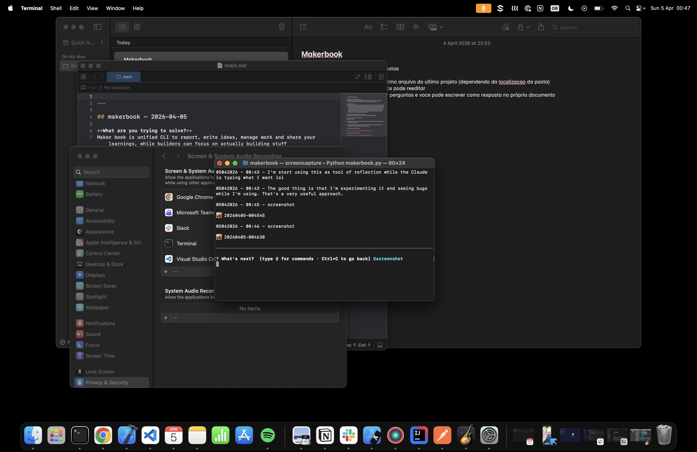
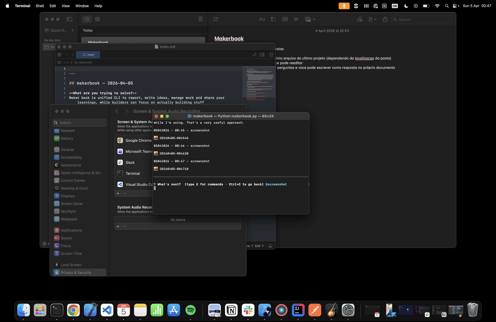
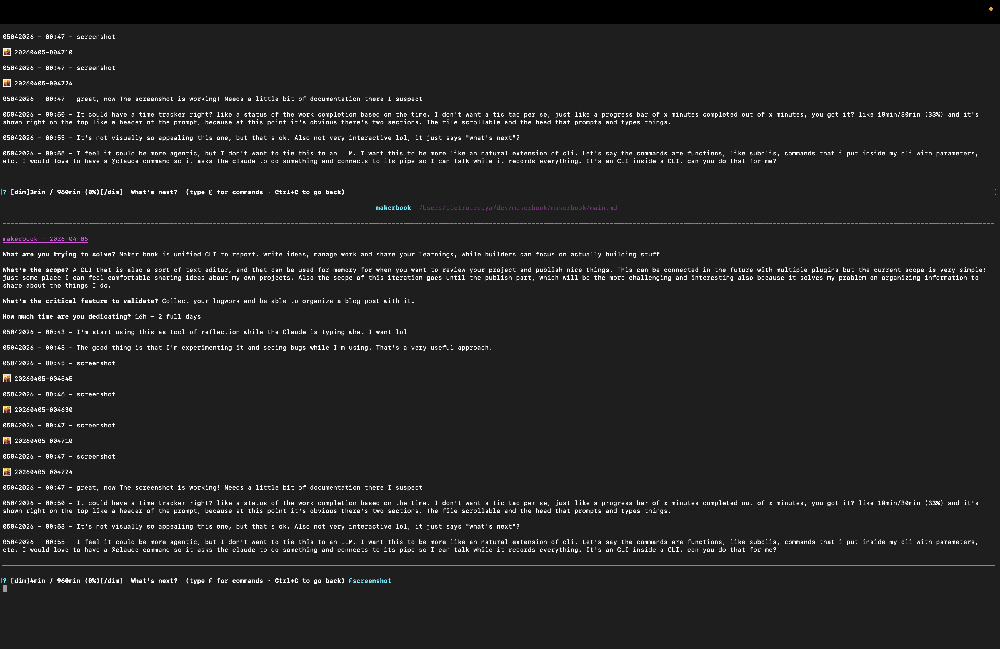
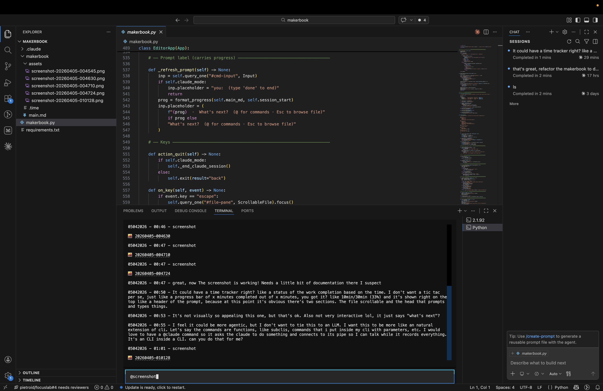
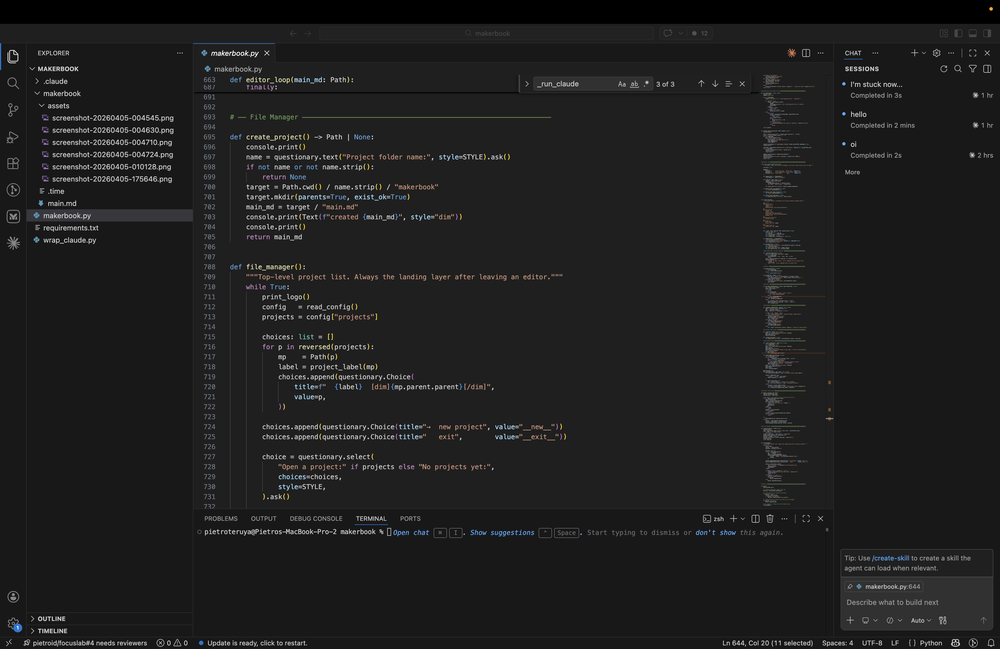
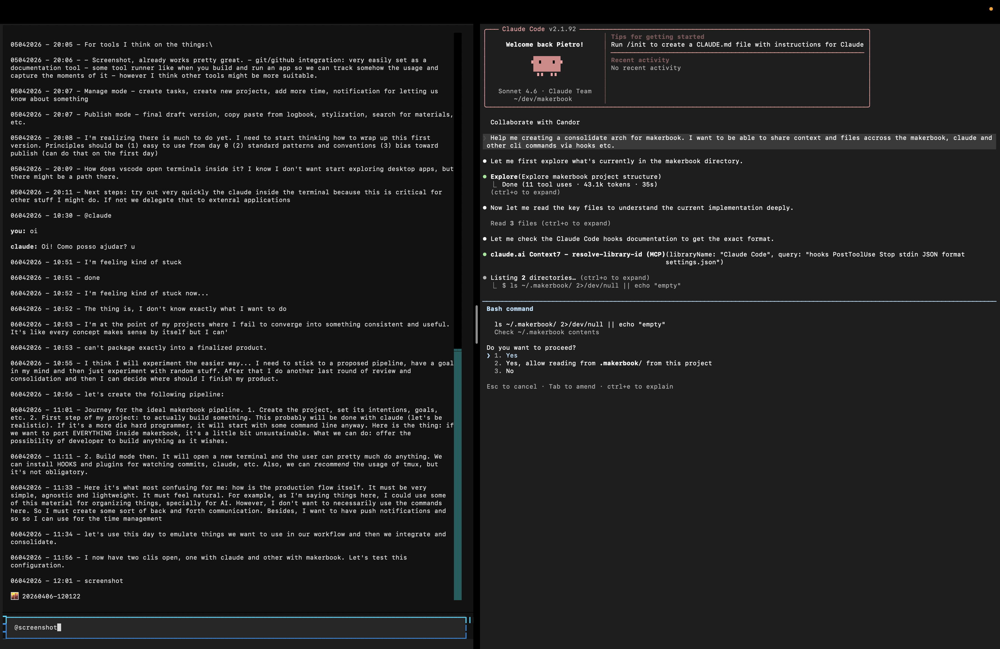
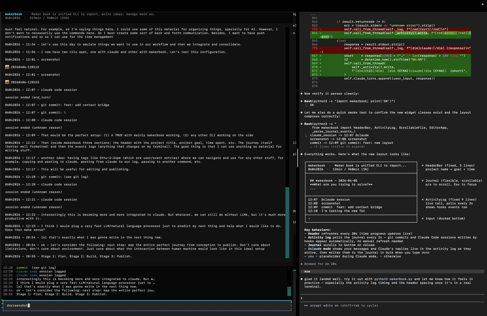
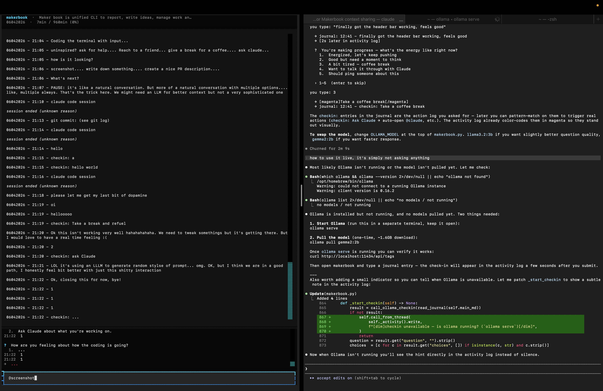
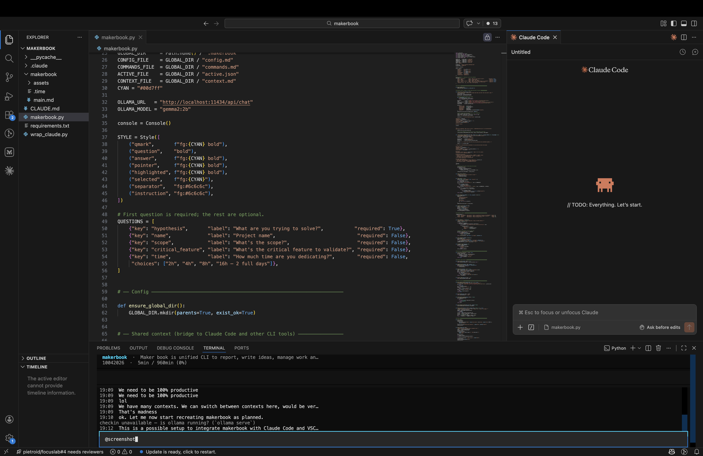
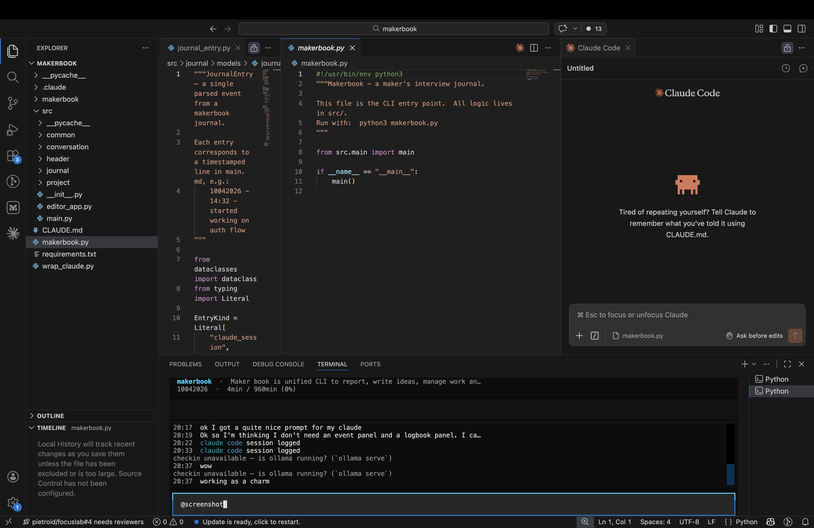

---

## makerbook — 2026-04-05

**What are you trying to solve?**
Maker book is unified CLI to report, write ideas, manage work and share your learnings, while builders can focus on actually building stuff

**What's the scope?**
A CLI that is also a sort of text editor, and that can be used for memory for when you want to review your project and publish nice things. This can be connected in the future with multiple plugins but the current scope is very simple: just some place I can feel comfortable sharing ideas about my own projects. Also the scope of this iteration goes until the publish part, which will be the more challenging and interesting also because it solves my problem on organizing information to share about the things I do.

**What's the critical feature to validate?**
Collect your logwork and be able to organize a blog post with it.

**How much time are you dedicating?**
16h — 2 full days

05042026 - 00:43 - I'm start using this as tool of reflection while the Claude is typing what I want lol

05042026 - 00:43 - The good thing is that I'm experimenting it and seeing bugs while I'm using. That's a very useful approach.

05042026 - 00:45 - screenshot

05042026 - 00:46 - screenshot

05042026 - 00:47 - screenshot

05042026 - 00:47 - screenshot

05042026 - 00:47 - great, now The screenshot is working! Needs a little bit of documentation there I suspect

05042026 - 00:50 - It could have a time tracker right? like a status of the work completion based on the time. I don't want a tic tac per se, just like a progress bar of x minutes completed out of x minutes, you got it? like 10min/30min (33%) and it's shown right on the top like a header of the prompt, because at this point it's obvious there's two sections. The file scrollable and the head that prompts and types things.

05042026 - 00:53 - It's not visually so appealing this one, but that's ok. Also not very interactive lol, it just says "what's next"?

05042026 - 00:55 - I feel it could be more agentic, but I don't want to tie this to an LLM. I want this to be more like an natural extension of cli. Let's say the commands are functions, like subclis, commands that i put inside my cli with parameters, etc. I would love to have a @claude command so it asks the claude to do something and connects to its pipe so I can talk while it records everything. It's an CLI inside a CLI. can you do that for me?

05042026 - 01:01 - screenshot

05042026 - 17:56 - screenshot

05042026 - 17:59 - esc

05042026 - 17:59 - thisisgettingfancy

05042026 - 20:00 - @claude

**you:** hello world

**claude:** Hello! How can I help you today?

**you:** refactor this project, split its files and comment what they are doing

**claude:** It looks like write permissions for new files aren't enabled. Could you approve the write to `/Users/pietroteruya/dev/makerbook/constants.py`? That will unblock creating all the new modules.

05042026 - 20:00 - I tried using claude, but I didn't like the interface. I need to stop AI slop and study more about terminal and stdin stdout to see what I can accomplish or not

05042026 - 20:03 - That is a theme of study! I think those types of commands are those that also used in the publish mode. By the way, I was thinking of using three modes, management, tools and publish. Management is about projects and time, and tasks etc. Tools are the tools that we need to use to make things, like terminal commands and other stuff. Publish is a pipeline-wise mode that I can prepare the material for publishing. My final case is to build makerbook again (?) or a small project using all those three stages!

05042026 - 20:04 - Study is also a kind of mode where we gather things, learn new things and understand better about some topics. We could use AI for this but I'm thinking: maybe if I fetch good sources than I have a tool for research and learning?

05042026 - 20:05 - I want to make this tool as independent from LLMs as possible - but with the ability of extension, of course. So I think the commands here will make a key difference, but the thing is I need to think about the details of each interface, etc.

05042026 - 20:05 - For tools I think on the things:\

05042026 - 20:06 - - Screenshot, already works pretty great. - git/github integration: very easily set as a documentation tool - some tool runner like when you build and run an app so we can track somehow the usage and capture the moments of it - however I think other tools might be more suitable.

05042026 - 20:07 - Manage mode - create tasks, create new projects, add more time, notification for letting us know about something

05042026 - 20:07 - Publish mode - final draft version, copy paste from logbook, stylization, search for materials, etc.

05042026 - 20:08 - I'm realizing there is much to do yet. I need to start thinking how to wrap up this first version. Principles should be (1) easy to use from day 0 (2) standard patterns and conventions (3) bias toward publish (can do that on the first day)

05042026 - 20:09 - How does vscode open terminals inside it? I know I don't want start exploring desktop apps, but there might be a path there.

05042026 - 20:11 - Next steps: try out very quickly the claude inside the terminal because this is critical for other stuff I might do. If not we delegate that to extenral applications

06042026 - 10:30 - @claude

**you:** oi

**claude:** Oi! Como posso ajudar?
u

06042026 - 10:51 - I'm feeling kind of stuck

06042026 - 10:51 - done

06042026 - 10:52 - I'm feeling kind of stuck now...

06042026 - 10:52 - The thing is, I don't know exactly what I want to do

06042026 - 10:53 - I'm at the point of my projects where I fail to converge into something consistent and useful. It's like every concept makes sense by itself but I can'

06042026 - 10:53 - can't package exactly into a finalized product.

06042026 - 10:55 - I think I will experiment the easier way... I need to stick to a proposed pipeline, have a goal in my mind and then just experiment with random stuff. After that I do another last round of review and consolidation and then I can decide where should I finish my product.

06042026 - 10:56 - let's create the following pipeline:

06042026 - 11:01 - Journey for the ideal makerbook pipeline. 1. Create the project, set its intentions, goals, etc. 2. First step of my project: to actually build something. This probably will be done with claude (let's be realistic). If it's a more die hard programmer, it will start with some command line anyway. Here is the thing: if we want to port EVERYTHING inside makerbook, it's a little bit unsustainable. What we can do: offer the possibility of developer to build anything as it wishes.

06042026 - 11:11 - 2. Build mode then. It will open a new terminal and the user can pretty much do anything. We can install HOOKS and plugins for watching commits, claude, etc. Also, we can _recommend_ the usage of tmux, but it's not obligatory.

06042026 - 11:33 - Here it's what most confusing for me: how is the production flow itself. It must be very simple, agnostic and lightweight. It must feel natural. For example, as I'm saying things here, I could use some of this material for organizing things, specially for AI. However, I don't want to necessarily use the commands here. So I must create some sort of back and forth communication. Besides, I want to have push notifications and so so I can use for the time management

06042026 - 11:34 - let's use this day to emulate things we want to use in our workflow and then we integrate and consolidate.

06042026 - 11:56 - I now have two clis open, one with claude and other with makerbook. Let's test this configuration.

06042026 - 12:01 - screenshot

06042026 - 12:01 - screenshot

06042026 - 12:07 - claude code session

*session ended (end_turn)*

06042026 - 12:07 - git commit: feat: add context bridge

06042026 - 12:07 - git commit: \

06042026 - 12:08 - claude code session

*session ended (unknown reason)*

06042026 - 12:09 - That would be the perfect setup: (1) A TMUX with mainly makerbook working, (2) any other CLI working on the side

06042026 - 12:12 - Then inside makerbook three sections: the header with the project title, project goal, time spent, etc. The journey itself (better well formatted) and then the events logs (anything that changes on my terminal). The good thing is that I can use anything as material for writing stuff.

06042026 - 12:17 - another idea: having tags like @thu-2:24pm (which are user/event entries) where we can navigate and use for any other stuff, for example, copying and pasting to claude, pasting from claude to our log, passing to another command, etc.

06042026 - 12:17 - This will be useful for editing and publishing.

06042026 - 12:20 - git commit: (see git log)

06042026 - 12:20 - claude code session

*session ended (unknown reason)*

06042026 - 12:21 - claude code session

*session ended (unknown reason)*

06042026 - 12:22 - interestingly this is becoming more and more integrated to claude. But whatever. we can still do without LLMs, but it's much more productive _with_ it.

06042026 - 12:23 - I think I would plug a very fast LLM/natural language processor just to predict my next thing and help what I would like to do. Does that make sense?

06042026 - 20:54 - lol that's exactly what I was gonna write in the next thing now.

06042026 - 20:54 - ok - let's consider the following: next step: map the entire perfect journey from conception to publish. Don't care about limitations, don't care about environment. Just care about what the interaction between human machine would look like in this ideal setup

06042026 - 20:55 - Stage 1: Plan, Stage 2: Build, Stage 3: Publish.

06042026 - 20:56 - screenshot

06042026 - 20:57 - Case study: makerbook itself.

06042026 - 20:58 - Makerbook is a tool for coders. It enables the building part to be more aware.

06042026 - 20:58 - It's an awareness exercise.

06042026 - 20:58 - What's the next step? The code always asks

06042026 - 20:59 - It's boring, unadaptative. It must suggest things.

06042026 - 20:59 - Yes, we can use LLMs. Local, for prefernce.

06042026 - 21:00 - Ok, the script would be something like, an interview!

06042026 - 21:00 - Human: I want to do a cli

06042026 - 21:00 - Machine: what's the first thing you want to create on this?

06042026 - 21:00 - A terminal with an input.

06042026 - 21:02 - options: - create a context (terminal with input) - set the time you want to do this - look for inspirations on the internet

06042026 - 21:04 - I will start coding something

06042026 - 21:04 - Coding the terminal with input...

06042026 - 21:05 - uninspired? ask for help.... Reach to a friend... give a break for a coffee.... ask claude...

06042026 - 21:05 - how is it looking?

06042026 - 21:06 - screenshot.... write down something.... create a nice PR description....

06042026 - 21:06 - What's next?

06042026 - 21:07 - PAUSE: it's like a natural conversation. But more of a natural conversation with multiple options.... like, multiple always. That's the trick here. We might need an LLM for better context but not a very sophisticated one

06042026 - 21:10 - claude code session

*session ended (unknown reason)*

06042026 - 21:13 - git commit: (see git log)

06042026 - 21:14 - claude code session

*session ended (unknown reason)*

06042026 - 21:14 - hello

06042026 - 21:15 - checkin: a

06042026 - 21:15 - checkin: hello world

06042026 - 21:16 - claude code session

*session ended (unknown reason)*

06042026 - 21:18 - please let me get my last bit of dopamine

06042026 - 21:19 - oi

06042026 - 21:19 - hellooooo

06042026 - 21:19 - checkin: Take a break and refuel

06042026 - 21:20 - Ok this isn't working very well hahahahahaha. We need to tweak somethings but it's getting there. But I would love to have a real time feeling :(

06042026 - 21:20 - 2

06042026 - 21:20 - checkin: ask Claude

06042026 - 21:21 - LOL it's using an LLLM to generate random stylse of prompt... omg. OK, but I think we are in a good path, I honestly feel bit better with just this shitty interaction

06042026 - 21:22 - Ok, closing this for now, bye!

06042026 - 21:22 - 1

06042026 - 21:22 - 1

06042026 - 21:22 - 1

06042026 - 21:22 - checkin: ...

06042026 - 21:22 - screenshot

06042026 - 21:22 - checkin: Asking Claude for some inspiration!

10042026 - 18:59 - Ok the UI needs to be improved. But overall I feel very good about this... Let me do some work on my client about configuring staging

10042026 - 19:00 - For clients, the stuff is more about time and less about learning or novelty. Ok, I need to reserve 30 min to solve the existing issues

10042026 - 19:00 - in that moment, it runs a clock for the next x mins....

10042026 - 19:00 - with the task name

10042026 - 19:03 - Idea for NCL: multirepo multilanguage agent

10042026 - 19:04 - The question is always: What should I do while I wait for agents? We live in the waiting line... Everything is serviced. World-as-a-service.

10042026 - 19:05 - The question is: What do I do while AI makes things for me? We are living in the eternal waiting line. Like a McDonalds. Everything is serviced. World-as-a-service.

10042026 - 19:09 - We need to be 100% productive

10042026 - 19:09 - We need to be 100% productive

10042026 - 19:09 - lol

10042026 - 19:09 - We have many contexts. We can switch between contexts here, would be very interesting. A multi-tasking multi-event CLI.

10042026 - 19:09 - That's madness

10042026 - 19:10 - ok. Let me now start recreating makerbook as planned.

10042026 - 19:12 - This is a possible setup to integrate makerbook with Claude Code and VSCode. Let me screenshot this

10042026 - 19:12 - screenshot

10042026 - 19:24 - ok, this is nice... I'm flowing with the staging setup

10042026 - 20:05 - waiting time now again...

10042026 - 20:17 - ok I got a quite nice prompt for my claude

10042026 - 20:19 - Ok so I'm thinking I don't need an event panel and a logbook panel. I can just unify both and have a stream of conversation. I just need to be really clear about the "agents" or "actors" involved. It can be me, it can be a bot, it can be the machine. It's always me and the machine, and any other process, in the timeline

10042026 - 20:22 - claude code session

*session ended (unknown reason)*

10042026 - 20:33 - claude code session

*session ended (unknown reason)*

10042026 - 20:37 - wow

10042026 - 20:37 - working as a charm

10042026 - 20:37 - screenshot

10042026 - 20:40 - claude code session

*session ended (unknown reason)*

10042026 - 20:43 - great

10042026 - 20:43 - I think I will use flutter for this maybe?

12042026 - 19:51 - create an app with four forces of desires: sensous, power (conatus), dharma (lawful), moksha (liberation)

12042026 - 19:51 - when force is unbalanced, it is invited to review

12042026 - 20:53 - claude code session

*session ended (unknown reason)*

12042026 - 20:54 - claude code session

*session ended (unknown reason)*

12042026 - 20:54 - claude code session

*session ended (unknown reason)*

12042026 - 20:56 - claude code session

*session ended (unknown reason)*

12042026 - 20:58 - git push

12042026 - 20:58 - claude code session

*session ended (unknown reason)*

12042026 - 21:41 - claude code session

*session ended (unknown reason)*

12042026 - 21:42 - claude code session

*session ended (unknown reason)*

12042026 - 21:43 - claude code session

*session ended (unknown reason)*

12042026 - 21:44 - claude code session

*session ended (unknown reason)*

12042026 - 21:45 - claude code session

*session ended (unknown reason)*

12042026 - 21:52 - claude code session

*session ended (unknown reason)*

12042026 - 22:09 - claude code session

*session ended (unknown reason)*

12042026 - 22:10 - claude code session

*session ended (unknown reason)*

12042026 - 22:10 - claude code session

*session ended (unknown reason)*

12042026 - 22:11 - claude code session

*session ended (unknown reason)*

12042026 - 22:13 - claude code session

*session ended (unknown reason)*

12042026 - 22:13 - claude code session

*session ended (unknown reason)*

12042026 - 22:26 - Ah, as aventuras do desenvolvimento. Fiquei uma hora e pouco tentando usar o dart com hotreload + utopia tui (tipo widgets para TUI) mas nao deu muito certo. No final estou voltando com python e lendo a doc https://textual.textualize.io/tutorial/ do textual, plataforma que o claude code vibe codou pra mim.

12042026 - 22:26 - ok gastei 1hr30 nisso. Isso eh interessante.

17042026 - 19:49 - claude code session

*session ended (unknown reason)*

17042026 - 19:53 - claude code session

*session ended (unknown reason)*

17042026 - 19:57 - claude code session

*session ended (unknown reason)*

17042026 - 20:05 - claude code session

*session ended (unknown reason)*

17042026 - 20:22 - claude code session

*session ended (unknown reason)*

17042026 - 20:25 - claude code session

*session ended (unknown reason)*

18042026 - 16:10 - claude code session

*session ended (unknown reason)*

18042026 - 16:12 - claude code session

*session ended (unknown reason)*

18042026 - 16:12 - claude code session

*session ended (unknown reason)*

18042026 - 16:15 - claude code session

*session ended (unknown reason)*

18042026 - 16:23 - claude code session

*session ended (unknown reason)*

18042026 - 16:25 - claude code session

*session ended (unknown reason)*

18042026 - 16:25 - claude code session

*session ended (unknown reason)*

18042026 - 16:27 - claude code session

*session ended (unknown reason)*

18042026 - 16:28 - claude code session

*session ended (unknown reason)*

18042026 - 16:32 - claude code session

*session ended (unknown reason)*
